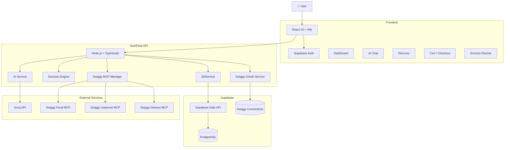

<div align="center">

# 🥗 NutriFlow AI

### AI-Powered Wellness & Food Commerce Copilot

<p>
  <strong>Eat smarter. Shop smarter. Live healthier.</strong>
</p>

<p>
  NutriFlow AI combines personalized nutrition intelligence,
  conversational AI, grocery planning, and Swiggy-powered
  food commerce into one unified experience.
</p>

<br/>


<br/>

### ⚡ AI • Nutrition • Food • Grocery • Dining • MCP

</div>

---

# 🌟 What is NutriFlow AI?

**NutriFlow AI** is a personalized wellness platform built around an AI-powered commerce copilot.

Instead of making users manually switch between nutrition apps, food delivery, grocery shopping, and restaurant discovery, NutriFlow connects these experiences through a single conversational interface.

The user describes an **outcome**.

The AI understands the intent, constraints, nutrition requirements, budget, and preferences, then determines which service should handle the task.

```text
                         👤 USER
                           │
                           ▼
                    🧠 AI COPILOT
                           │
                           ▼
                 🎯 DECISION ENGINE
                           │
             ┌─────────────┼─────────────┐
             ▼             ▼             ▼
        🍽️ FOOD       🛒 INSTAMART    🍴 DINEOUT
             │             │             │
             └─────────────┼─────────────┘
                           ▼
                    ⚙️ OPTIMIZATION
                           │
                           ▼
                    👀 USER REVIEW
                           │
                           ▼
                  ✋ CONFIRMATION
                           │
                           ▼
                       ⚡ ACTION
````

---

# 🚀 Why NutriFlow?

Traditional wellness applications usually stop at:

> "Here is what you should eat."

NutriFlow aims to continue the workflow:

> "Here is what you should eat, where to get it, what it costs, and what I can do next."

### Example

```text
"I want a high-protein dinner under ₹500."

              ↓

       🧠 AI understands

              ↓

       🎯 Applies constraints

              ↓

      🍽️ Search Food options

              ↓

      📊 Compare nutrition

              ↓

       💰 Check budget

              ↓

       👀 Show options

              ↓

      ✋ Ask for confirmation

              ↓

          ⚡ Execute
```

---

# ✨ Features

## 🤖 AI Wellness Copilot

* Conversational AI assistance
* Streaming AI responses
* Nutrition-aware recommendations
* Personalized meal suggestions
* Goal-aware responses
* Dietary preference awareness
* Allergy-aware recommendations
* AI-generated grocery plans
* Model fallback architecture
* Tool-oriented AI workflows

---

## 📊 Personalized Wellness Dashboard

* Personalized user profile
* Wellness score
* Calorie tracking
* Macro tracking
* Progress visualization
* Streak tracking
* Personalized wellness insights
* Goal-based recommendations

---

## 🍽️ Smart Food Discovery

* Browse meals
* Cuisine filtering
* Dietary filtering
* Calorie-aware discovery
* Protein-aware recommendations
* Health scoring
* Save meals
* Add meals to cart
* Nutrition preview

---

## 🛒 AI Grocery Planner

Transform a requirement into a structured shopping plan.

```text
User Requirement
      ↓
AI Planning
      ↓
Ingredient Extraction
      ↓
Category Grouping
      ↓
Nutrition Context
      ↓
Shopping Workflow
```

Features include:

* AI-generated grocery plans
* Weekly planning
* Category grouping
* Ingredient organization
* Nutrition notes
* Cart integration
* Instamart workflow

---

# 🛍️ Swiggy MCP Integration

NutriFlow integrates with the **Swiggy MCP ecosystem** to connect AI-driven intent with food commerce workflows.

### Integrated Services

| Service                 | Capability                      |
| ----------------------- | ------------------------------- |
| 🍽️ **Swiggy Food**     | Food and restaurant discovery   |
| 🛒 **Swiggy Instamart** | Grocery/product discovery       |
| 🍴 **Swiggy Dineout**   | Restaurant and dining workflows |

---

# 🧠 AI Commerce Copilot

The core concept is:

```text
                 USER INTENT
                     │
                     ▼
              🧠 AI COPILOT
                     │
                     ▼
            INTENT UNDERSTANDING
                     │
                     ▼
             🎯 SERVICE ROUTER
                     │
        ┌────────────┼────────────┐
        ▼            ▼            ▼
      FOOD        INSTAMART     DINEOUT
        │            │            │
        └────────────┼────────────┘
                     ▼
                 OPTIMIZE
                     │
                     ▼
               USER REVIEW
                     │
                     ▼
              CONFIRM ACTION
                     │
                     ▼
                  EXECUTE
```

This architecture allows NutriFlow to treat Swiggy services as **tools available to the AI**, rather than separate application screens.

---

# 🧩 Example AI Workflows

## 🍝 Recipe → Smart Cart

```text
"I want to make high-protein chicken pasta."

                ↓

          🧠 AI understands

                ↓

          🍝 Recipe planning

                ↓

        🧾 Ingredient extraction

                ↓

       🛒 Instamart product search

                ↓

        🔄 Product substitutions

                ↓

          💰 Cost calculation

                ↓

          📊 Nutrition analysis

                ↓

          👀 Review cart

                ↓

          ✋ Confirmation

                ↓

             ⚡ Execute
```

---

## 🍽️ Food Recommendation

```text
"Find me a healthy dinner under ₹400."

              ↓

       Understand constraints

              ↓

        Search restaurants

              ↓

       Filter available meals

              ↓

     Nutrition + budget analysis

              ↓

          Show options

              ↓

       User chooses / confirms

              ↓

             Action
```

---

## 🍴 Dineout

```text
"Find a good restaurant for
4 people within our budget."

              ↓

        Group requirements

              ↓

       Restaurant discovery

              ↓

       Budget consideration

              ↓

        Offers / options

              ↓

          User review

              ↓

        Confirmation

              ↓

            Action
```

---

# 🏗️ Architecture



---

# 🔐 OAuth Architecture

Swiggy connectivity uses an OAuth-based delegated authorization flow.

```text
             👤 User
                │
                ▼
        NutriFlow Connect
                │
                ▼
       OAuth Authorization
                │
                ▼
       🔐 Swiggy Authorization
                │
                ▼
            User Consent
                │
                ▼
       Authorization Code
                │
                ▼
        NutriFlow Callback
                │
                ▼
       Server-side Exchange
                │
                ▼
        🔑 Access Token
                │
                ▼
       Secure Server Storage
                │
                ▼
          MCP Connection
```

### OAuth protections

* OAuth 2.1
* PKCE with S256
* Cryptographic state
* Single-use state validation
* Dynamic Client Registration
* Server-side authorization code exchange
* Server-side token storage
* Token expiration handling

---

# 🛡️ Side-Effect Protection

NutriFlow distinguishes between **read-only operations** and **actions that create external side effects**.

### Read-only

```text
Search restaurant
Search food
Search grocery products
View information
Calculate nutrition
```

These can be processed without an execution confirmation.

### Side-effecting

```text
Add item to cart
Checkout
Place order
Create reservation
Modify external state
```

These require explicit confirmation.

```text
              AI
               │
               ▼
        Proposed Action
               │
               ▼
       ┌───────────────┐
       │ Confirmation? │
       └───────┬───────┘
               │
        ┌──────┴──────┐
        ▼             ▼
       NO            YES
        │             │
        ▼             ▼
      STOP       User confirms
                      │
                      ▼
                   EXECUTE
```

---

# 🧰 Tech Stack

| Layer                   | Technology           |
| ----------------------- | -------------------- |
| **Frontend**            | React 19             |
| **Language**            | TypeScript           |
| **Build Tool**          | Vite 7               |
| **Styling**             | Tailwind CSS v4      |
| **UI**                  | shadcn/ui + Radix UI |
| **Animations**          | Framer Motion        |
| **Routing**             | Wouter               |
| **State / Server Data** | TanStack React Query |
| **Authentication**      | Supabase Auth        |
| **Database**            | Supabase PostgreSQL  |
| **Database Access**     | Supabase Data API    |
| **AI**                  | Groq API             |
| **Backend**             | Node.js + TypeScript |
| **Validation**          | Zod                  |
| **Commerce Protocol**   | Swiggy MCP           |
| **Authorization**       | OAuth 2.1 + PKCE     |
| **Package Manager**     | pnpm                 |

---

# 📁 Project Structure

```text
NUTRIFLOW_AI/
│
├── artifacts/
│   │
│   ├── nutriflow/
│   │   └── src/
│   │       ├── components/
│   │       ├── hooks/
│   │       ├── lib/
│   │       └── pages/
│   │
│   ├── api-server/
│   │   └── src/
│   │       ├── lib/
│   │       ├── mcp/
│   │       ├── routes/
│   │       ├── services/
│   │       └── middlewares/
│   │
│   └── mockup-sandbox/
│
├── lib/
│   ├── api-client-react/
│   ├── api-spec/
│   ├── api-zod/
│   └── db/
│
├── specs/
│   └── swiggy-mcp/
│       ├── requirements.md
│       ├── design.md
│       ├── tasks.md
│       └── tests.md
│
├── IMPLEMENTATION_CONTEXT.md
├── package.json
├── pnpm-workspace.yaml
├── tsconfig.json
└── .env.example
```

---

# 🚀 Quick Start

## Prerequisites

Make sure you have:

* Node.js 18+
* pnpm 9+
* Supabase project
* Groq API key
* Swiggy MCP access for commerce functionality

---

## 1️⃣ Clone

```bash
git clone https://github.com/gnanendramunagapaka/NUTRIFLOW_AI.git
cd NUTRIFLOW_AI
```

---

## 2️⃣ Install Dependencies

```bash
pnpm install
```

---

## 3️⃣ Configure Environment

Copy the example configuration:

```bash
cp .env.example .env.local
```

Then configure your local credentials.

Example:

```env
VITE_SUPABASE_URL=https://your-project.supabase.co
VITE_SUPABASE_ANON_KEY=your-public-anon-key

SUPABASE_URL=https://your-project.supabase.co
SUPABASE_SECRET_KEY=your-server-only-secret

GROQ_API_KEY=your-groq-api-key

PORT=5173
BASE_PATH=/
NODE_ENV=development

SWIGGY_REGISTER_URL=https://mcp.swiggy.com/auth/register
SWIGGY_AUTHORIZATION_URL=https://mcp.swiggy.com/auth/authorize
SWIGGY_TOKEN_URL=https://mcp.swiggy.com/auth/token
SWIGGY_REDIRECT_URI=https://your-domain/auth/callback/

SWIGGY_FOOD_MCP_URL=https://mcp.swiggy.com/food
SWIGGY_INSTAMART_MCP_URL=https://mcp.swiggy.com/im
SWIGGY_DINEOUT_MCP_URL=https://mcp.swiggy.com/dineout
```

> ⚠️ Never commit `.env` or `.env.local`.

---

# ▶️ Running NutriFlow

Start the development environment using the workspace scripts:

```bash
pnpm run dev
```

If you need to run individual workspaces:

```bash
pnpm --filter @workspace/nutriflow run dev
```

and:

```bash
pnpm --filter @workspace/api-server run start
```

Open:

```text
http://localhost:5173
```

---

# 🗄️ Database

NutriFlow uses **Supabase Authentication + Supabase Data API + PostgreSQL**.

Core tables include:

| Table                    | Purpose                        |
| ------------------------ | ------------------------------ |
| `user_profiles`          | Personalized wellness profile  |
| `wellness_tracking`      | Wellness tracking              |
| `onboarding_preferences` | User preferences               |
| `restaurants`            | Restaurant-related data        |
| `meals`                  | Meal data                      |
| `saved_meals`            | User saved meals               |
| `cart_items`             | User cart                      |
| `grocery_lists`          | Grocery lists                  |
| `grocery_items`          | Grocery items                  |
| `conversations`          | AI conversations               |
| `messages`               | AI messages                    |
| `swiggy_connections`     | Server-side Swiggy connections |

---

# 👤 Multi-User Data Isolation

User-specific operations follow this model:

```text
Supabase Auth
      │
      ▼
Authenticated Session
      │
      ▼
authMiddleware
      │
      ▼
Authenticated user_id
      │
      ▼
DbService
      │
      ▼
User-scoped query
      │
      ▼
Supabase Data API
```

NutriFlow does not rely on a shared application-level user context for authorization.

User-owned database operations are explicitly scoped to the authenticated user.

---

# 🔒 Security

Security is built into the architecture.

## Browser

The browser may contain:

```text
✓ Supabase public anon key
✓ User authentication session
✓ UI state
```

The browser must never contain:

```text
✗ Supabase server secret
✗ Groq API key
✗ Swiggy access token
✗ OAuth authorization code
✗ OAuth PKCE verifier
✗ Database passwords
```

---

## Server

Server-side credentials are kept in environment variables and are never intentionally returned to the client.

```text
Browser
   │
   │ HTTPS
   ▼
API Server
   │
   ├── Groq API
   │
   ├── Supabase Data API
   │
   └── Swiggy MCP
```

---

# 🧪 Verification

NutriFlow includes automated verification for major infrastructure components.

### Verified

* ✅ Supabase Data API connectivity
* ✅ Real database reads/writes
* ✅ Multi-user isolation
* ✅ Authentication middleware
* ✅ OAuth state validation
* ✅ PKCE S256
* ✅ Dynamic Client Registration
* ✅ Swiggy MCP protocol handling
* ✅ MCP initialization
* ✅ MCP tool discovery
* ✅ Side-effect confirmation gate
* ✅ Token expiration handling
* ✅ Live Groq inference
* ✅ Groq fallback models
* ✅ TypeScript validation
* ✅ Production build

Run:

```bash
pnpm run typecheck
```

Then:

```bash
pnpm run build
```

---

# 📊 Reliability Architecture

NutriFlow's AI layer supports model fallback.

```text
             AI Request
                 │
                 ▼
          Primary Groq Model
                 │
          ┌──────┴──────┐
          │             │
       Success        Failure
          │             │
          ▼             ▼
       Response      Fallback
                        │
                        ▼
                 Secondary Model
                        │
                  ┌─────┴─────┐
                  │           │
               Success      Failure
                  │           │
                  ▼           ▼
               Response    Next Model
```

This prevents a temporary provider/model failure from unnecessarily breaking the application.

---

# 🧪 Development Philosophy

NutriFlow follows a specification-driven development approach for major integrations.

```text
Requirements
     ↓
Design
     ↓
Tasks
     ↓
Implementation
     ↓
Tests
     ↓
Verification
```

Swiggy integration specifications are maintained under:

```text
specs/swiggy-mcp/
```

---

# 🛣️ Roadmap

## ✅ Completed

* [x] Supabase authentication
* [x] Personalized onboarding
* [x] Wellness dashboard
* [x] AI assistant
* [x] Meal discovery
* [x] Saved meals
* [x] Persistent cart
* [x] Grocery planning
* [x] Supabase Data API migration
* [x] Multi-user isolation
* [x] Swiggy OAuth architecture
* [x] OAuth 2.1
* [x] PKCE S256
* [x] Dynamic Client Registration
* [x] Swiggy MCP manager
* [x] Food MCP integration
* [x] Instamart MCP integration
* [x] Dineout MCP integration
* [x] Side-effect confirmation gate
* [x] Live Groq integration
* [x] AI fallback architecture
* [x] Security verification
* [x] Build and typecheck verification

## 🔄 Remaining

* [ ] Complete real Swiggy user OAuth consent flow
* [ ] Full live Food MCP workflow with an authorized account
* [ ] Full live Instamart workflow
* [ ] Full live Dineout workflow
* [ ] Production deployment hardening
* [ ] Expanded observability
* [ ] Analytics and monitoring

---

# 📸 Product Journey

The intended experience:

```text
        SIGN UP
           │
           ▼
      ONBOARDING
           │
           ▼
       DASHBOARD
           │
           ▼
        ASK AI
           │
           ▼
    PERSONALIZED PLAN
           │
     ┌─────┼─────┐
     ▼     ▼     ▼
   FOOD  GROCERY DINEOUT
     │     │       │
     └─────┼───────┘
           ▼
         REVIEW
           │
           ▼
       CONFIRM
           │
           ▼
        EXECUTE
```

---

# 🤝 Contributing

### Create a feature branch

```bash
git checkout -b feature/my-feature
```

### Make your changes

```bash
git add .
```

### Commit

```bash
git commit -m "feat: add my feature"
```

### Push

```bash
git push origin feature/my-feature
```

Then open a Pull Request.

---

## 📝 Commit Convention

Recommended:

```text
feat: add Instamart smart cart
fix: handle expired Swiggy token
refactor: improve MCP manager
test: add OAuth state tests
docs: update setup guide
chore: update dependencies
```

---

# ⚠️ Security Checklist

Before pushing code:

```text
[ ] No .env files
[ ] No API keys
[ ] No OAuth tokens
[ ] No passwords
[ ] No authorization codes
[ ] No database credentials
[ ] No hardcoded provider secrets
[ ] No credentials in console.log
```

Check:

```bash
git status
```

and make sure:

```text
.env
.env.local
```

are ignored.

---

# 📄 License

This project is licensed under the **MIT License**.

See [`LICENSE`](LICENSE) for details.

---

<div align="center">

# 🥗 NutriFlow AI

### AI × Nutrition × Food Commerce

**Eat smarter. Shop smarter. Live healthier.**

<br/>

Built with ❤️ by **Gnanendra Munagapaka** and contributors.

<br/>

⭐ **Star the repository if you like the project.**

<br/>

`React` · `TypeScript` · `Vite` · `Supabase` · `Groq` · `Swiggy MCP` · `OAuth 2.1`

</div>
```


should appear.
